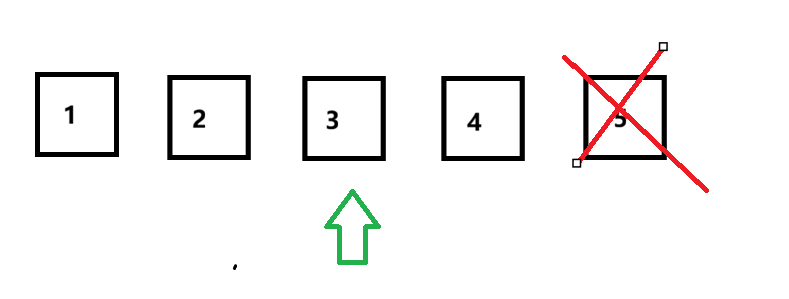

### Combinatorics, probability and statistics

#### 1. Conditional Probability

##### **1) The Monty Hall Problem.**

> The [Monty Hall problem](https://en.wikipedia.org/wiki/Monty_Hall_problem) is a counter-intuitive statistics puzzle:
>
> - There are 3 doors, behind which are two goats and a car.
> - You pick a door (call it door A) but don't open it.
> - Monty Hall, the game show host, who only knows behind which doors are goats , examines the other doors (B & C) and opens one with a goat. 
> - Then he asks you to decide whether to swap the door to the other or not. 

Why does the probability to win a car increase to 2/3 if we swap? 

The probability to choose one of two goats is 2/3 and a car is 1/2. After Monty Hall opens the door concealing a goat, if a player chooses the goat, of which the probability is 2/3, and then swap, the chance to win a car is 2/3, because the car is definitely behind the other door. If this player doesn't swap, the probability is still 1/3.

***A complicated case of "The Monty Hall Problem".*** 

If there are more doors, do we still have the same probability to win the car? 

As an illustration, there 5 doors with 4 doors concealing goats and 1 concealing a car, the player chooses door 3 and the host opens 5. Should the player swap or not? 

The probability of selecting goats is 4/5; if the host opens a door behind which there is a goat, there are 3 doors left. The chance to win the car is ${4\over 5} \times {1\over 3}$. Generally, the formula is ${n - 1 \over n} \times {1 \over n-2}$. If n is extremely large, it  equals to $1 \over n$, because $n-1$ and $n-2$ are almost same in this scenario. 

##### 2) The two-child problem

1. Mrs Smith has two children. The eldest one is a boy. What’s the chance that both are boys?

   Since it said the eldest one is a boy, we only need to the probability that the younger one is a boy. It is an independent case because the gender of the younger one is not affected by whatever the gender of the eldest child is. Thus, the answer is 1/2. 

2. Mrs Jones has two children. At least one is a boy. What’s the chance that both are boys?

   It said, "At least one is a boy" and didn't mention the seniority. There are three combinations in which at least one child is a boy; they are: 

   > Elder 	Younger
   >
   > boy		girl
   >
   > boy		boy
   >
   > girl		boy

   Among these three options is only one case is that both of them are boys, therefore, the probability is 1/3. 

3. Mrs Robinson has two children. **At least one is a boy born on a Monday**. What’s the chance that both are boys? 

   For one child(two genders), there are  `2 * 7 = 14` in total, in which either a boy or a girl is born on Monday. On the rest of 6 days there are `2 *6` ways, then wen can get: 

   > 2 * 7 = (1 + 1)  + (2 * 6)   // (1 + 1) means that the possibility of a boy and a girl. 
   >
   > ​    	 = 1 + (1 + 12)	// 1 girl on Monday plus the cases from Tuesday to Sunday. 

   Hence, we conclude that the combinations of no boys is born on Monday is 13. For 2 children(one is older and the other is younger), it is `13 * 13 = 169`. That means there are 169 cases in which no boy is born on Monday. The rest is that **at least one boy is born on Monday**: `14 * 14 - 13 * 13 = 27`. There might be 2 boys or 1 boy, but among them at least one boy is born on Monday. 

   Next, we should find out how many cases in which both are boys and one is born on Monday. Note boys can be older or younger, too. First of all, we can get the number of that both are boys: `7 * 7 = 49`, because the older boy might be born on any of 7 days, so is the younger one, therefore, it is `7 * 7`. The number of that boys aren't born on Monday is `6 * 6`. We can get `7 * 7 - 6 * 6 = 13`, which is at least one boy born on Monday if they both are boys. 

   It is `13 / 27`.

   

   

##### 3) Random Permutation

#### 2. Standard Normal Distribution Table

In standard normal distribution table, the line graph is symmetric. 