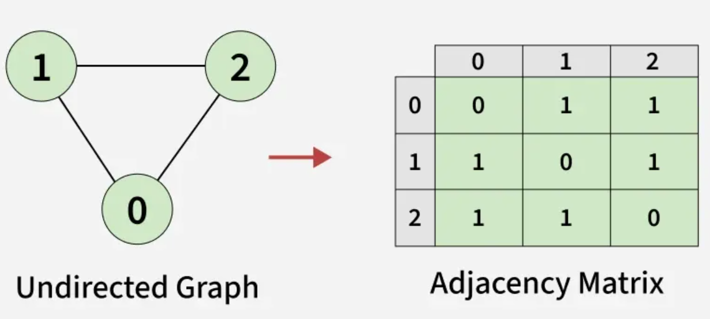
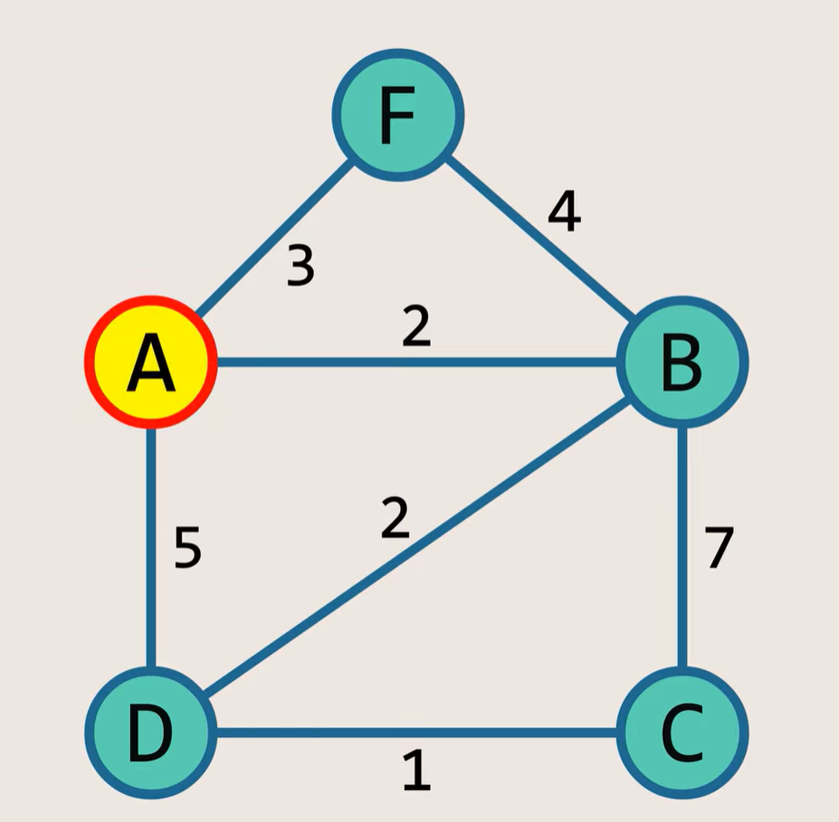
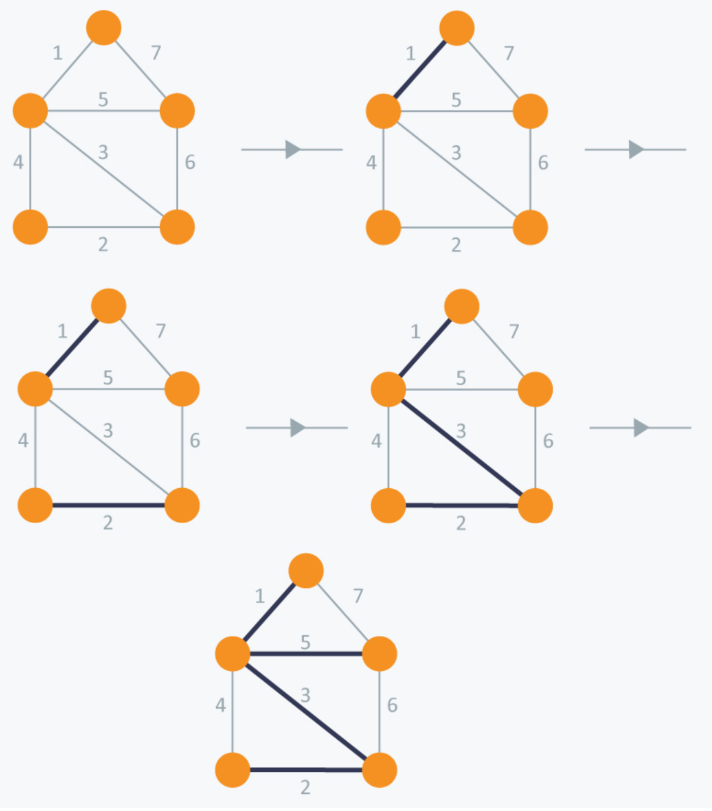

## Graph Theory

### 0. Terminology 

1. Undirected graph: no direction

   undirected complete graph

2. Directed graph: for example, one is following another in Facebook. 

3. Weighted graph: edges have values.

4. Degree: the total number of edges of every nodes in a graph. It is always even, because is 2*E and each edge is counted twice-each edge connect two nodes and these two nodes count twice for degrees.

5. Tree: It is a graph without any circle and its edges = nodes - 1. It is usually used in weighted undirected graphs. 

### 1. Representation

#### Adjacency Matrix

How to represent a undirected graph with a adjacency matrix? 



We can sue two-dimension array to achieve it. As an illustration, use the the number of rows as the number of vertices and use the value in the second dimension to represent a connected vertex.

```c
int matrix[3][3] = {{0, 1, 1}, {1, 0, 1}, {1, 1, 0}};
// The first index, 0, represents vertex 0 and the second vertex 0 also represents 
// vertex 0. Its value is 0, which indicates that a vertex can NOT connect itself.
matrix[0][0] = 0;
// The value of `matric[0][1]` is 1, which means "connected".
matrix[0][1] = 1;	
```

**Disadvantage of Adjacency Matrix**

Note one disadvantage of adjacency matrix representation is that that wastes too much memory when there are not so many edges, namely too many 0s.  To save more space, we can use adjacency list. 

#### Adjacency List 

It is literally a sparse array of an array of adjacency matrix 

```txt
0 -- 1
| \    
|  \   
2 -- 3 -- 4
      \
       5
```

Represent the above undirected graph in adjacency list. 

```c
int vertex0[] = {1, 2, 3};
int vertex1[] = {0, 4};
int vertex2[] = {0, 3};
int vertex3[] = {0, 2, 4, 5};
int vertex4[] = {1, 3};
int vertex5[] = {3 };
```

Since `vertex0` only connects `1, 2, 3`, we only put them in the array `vertex0`  and omit edges. 

### 2. Search for Graphs

(1) DFS: LIFO (stack)

1) If a node is visited, delete it from the stack and then find non-visited nodes of the element on the top. 

```txt
0 -- 1
| \    
|  \   
2 -- 3 -- 4
      \
       5
```

1.1) Let's start with 0. Visit it and then put it into an visited group. 

`visited: 0`. 

1.2) 

(2) BFS: FIFO (queue)

How to use a queue as a data structure to do BFS?

Put the next node to the queue, then pop it and find all the neighbours; put them in the queue. 

Then find the neighbours of the first element and do the same. 

### 3. Minimum spanning trees

3.1) What is minimum spanning tree?

It is to find a tree with the minimum weight covering  all the nodes in a graph. 

Don't create a circle, which is not a tree. 

3.2) Algorithms for minimum spanning tree.

#### **Prim's Algorithms**



Find the minimum spanning tree with Prim's algorithm. 

1. Let's start with vertex A.  Put a in a visited array `visited{A}`. There are three vertices connected to A; find the minimum edges between. It is B with the edge of weight of 2. Then add B to the visited array: `visited{A, B}` and the tree is as follows:

   ```txt
   A---B
   ```

2. Find out the minimum edge of the all visited vertices: `visited: {A, B}`.  We can see that `B-A`  and `B-D` have the same weight, 2. Since A is visited, we connect B with D and build the tree with the edge between.

   `visited{A, B, D}`

   ```txt
   A---B
   |
   D
   ```

3. The next is to find the minimum edge of the all visited vertices: `visited: {A, B, D}`. Since A and B have been added to the visited list, the next vertex is C with the minimum edges. Put it into the visited vertices: `visited: {A, B, D, C}`

   ```txt
   A---B
   |
   D---C
   ```

4. What is next step? Keep on searching for non-visited vertices of `visited: {A, B, D, C}` and we find `A-F=3 ` and `B-F=4`. Add `3` to the tree and connect `F`. 

   ```txt
    F
   /
   A---B
   |
   D---C
   ```

   This is the minimum spanning tree and its weight is `2+5+1+7+3=18`.

#### Kruscal Algorithm



Use Kruscal Algorithm to find the minimum spanning tree. 

1. First of all, select the minimum edge, which is 1 in the above graph.

2. Then select the minimum one the rest of edges, namely 2.

3. Since 3 is the smallest edge, select it. 

4. Although 4 is the next minimum one, there will be a cycle when select it. A tree has not any cycle. We select 5.

   The minimum spanning tree has been found. 


### 4. Dijkstra's Algorithm

What is it?

Find the shortest path. 

Applied for non-negative edges. 

The node in S2 doesn't need to be verified, because they have shortest paths to other nodes. 

Negative edges: travelling to a place and you are subsidised instead of spending money. 

### 5. Topological Sort in a DAG

DAG: directed acyclic graph.

acyclic: no cycle

directed: it has direction. 

Examples: production management. If you want to do task B, you must do task A first. 

Start with the node without any incoming edges. 

If there is no vertex with 0 incoming edges, there must be a circle in the graph. As a result, topological sort can NOT be applied. 

Topological sort is better than Dijkstra algorithm. 

### 6. Colouring graph

Find the minimum number to colour nodes of an undirected graph and no connected nodes have the same colour. 

Tips

1) A tree only need two kind of colours, because  there is no circle in it. 

### 7. Bipartite Graph

A bipartite graph is also a tree, because it can use only two colours to every node so that no connected nodes have same colour. 

### 8. Hamiltonian Path and Cycle

What is a Hamiltonian path?

A Hamiltonian path is a path in a directed or undirected graph that visits each vertex only once.

What is a Hamiltonian cycle?

It is a Hamiltonian path that returns it first vertex and forms a cycle. 

Note: 

1. We don't have to start with 0.
2. There is NOT any efficient algorithms for Hamiltonian path. 
3. A Hamiltonian path deal with vertices while a Euler's deals with edges. 

### 9. Euler's Path and Cycle

1) Euler's path: to cover all the edges only once and can visit any nodes multiple times. 

When is there an Euler's path?

In a undirected graph, if and only if there are only **two** nodes with odd degrees. Start from the nodes with odd degrees. 

2) Euler's cycle: all nodes have even degrees.

Here a cycle is not a path. 

### Miscellaneous

Tree: edges = nodes - 1. One node is a tree by definition. 

[Algorithms for graph](https://www.hackerearth.com/practice/algorithms/graphs/topological-sort/tutorial/)


