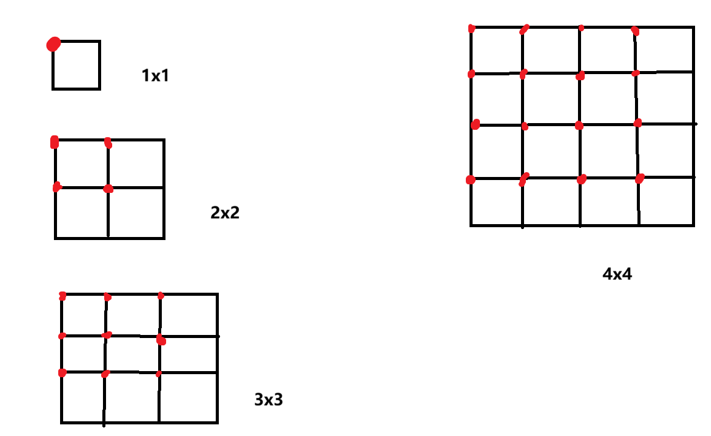
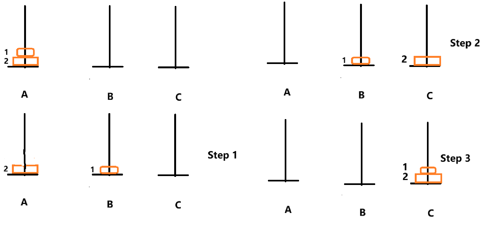
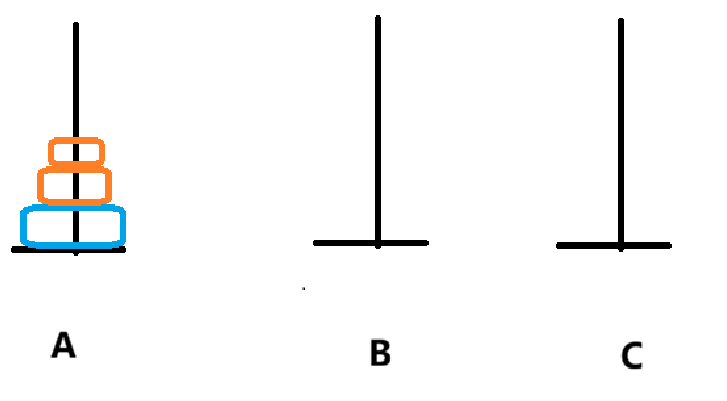

### Puzzles

Solutions of puzzles of Mathematics for Programming in the programme in Wintec. 

#### 2. Measuring exactly 4 litres of water

> You have a 5-litre Jug and a 3-litre Jug and an unlimited supply of water. You need to measure exactly 4-litre of water but there is no measuring instrument or cup. Also, Jugs are oddly shaped and don't contain any marks.  

Note it says that to measure exactly 4 litres of water, but not to measure 2 * 2 litres. 

1. Fill the 5-litre jug full with water.

2. Then fill the 3-litre jug fully with the water from the 5-litre jug; there are 2 litres of water remained in the 5-litre jug.

3. Pour the water in the 3-litre jug out and fill it with the remaining 2 litres of water in the 5-litre jug. Now the the 3-litre jug needs 1 more litre to be full. 

4. Fill the 5-litre jug full with water again and pour the water in it to the 3-litre jug until the latter is full. 

   As a result, there are 4 litres of water in the 5-litre jug.

#### 3. Number of squares in a chess board  

> How many squares in a chess board?

Suppose the length of one side of a square is 1, not only are there 1\*1 squares, but also there are 2\*2, 3\*3... 



1. Let's start with a small chess board with only one 1x1 square. 

   We start with the vertex on the top left corner. There is only one square with area of 1x1.

   The number is $1$, which is $1^2$

2. Then count squares in a 2x2 chess board. 

   First of all, count squares of 1x1 from the top left corner, too. 

   We only count vertices of squares because it is easy and we don't make mistakes by counting more ones. Note that these vertices of squares overlap each other. Be careful. 

   There are 4 1x1  squares. 

   Secondly, count squares of 2x2.  Start from the top left corner, too. 

   There are only 1 "2x2" squares. 

   The number is $4 + 1$ which is $2^2 + 1$. 

3. Count the squares in "3x3" chess board. 

   Note that count the vertices. 

   1x1: 9 = $3^2$

   2x2: 4 = $2^2$		The 4 red vertices on the top left corner are the vertices of these 4 "2x2" squares. 

   3x3: 1 = $1^2$

#### 4. Fizzbuzz

Here is the code: 

```c
#include <stdio.h>

void fizzbuzz();
int main(int argc, char *argv[])
{
	fizzbuzz();
	return 0;
}

void fizzbuzz() {
	int i;
	for (i = 1; i <= 100; i++) {
		// The condition to test the multiples of 3 and 5 should be the first 
		// branch. or it will never be executed. 
		if ((i % 3 == 0) && (i % 5 == 0))
			printf("Number: %d, FizzBuzz\n", i);
		else if (i % 5 == 0) 
			printf("Number: %d, Buzz\n", i);
		else if (i % 3 == 0)
			printf("Number: %d, Fizz\n", i);
	}

}
```

#### 5. Suicide circle

Let's start with 1 soldier and assume that however many soldiers we start the killing with NO. 1. 

```txt
N		Survivor
1		1
2		1			# 1
3		3
4		1			# 1
5		3
6		5
7		7
8		1			# 1
9		3
10		5
11		7
12		9
13		11
14		13
15		15
16		1			# 1
```

We can find that if the number is the power of two, the survivor is always of NO. 1. How do we know it is still 1 if the exponent is 100, such as $2^{100}$?  It is easy; After the first round of killing, $2^{100} \div 2 = 2^{99}$ and NO. 1 starts killing in the next round until the last two soldiers. 

How can we know where Josephus is if the number is not the power of 2? 

Suppose there are 7 soldiers, who is the survivor? 

Since we know who is the survivor when there are 4 soldiers, the question becomes how many soldiers should be killed until there are 4 remained. We can't add more soldiers to 8, but kill them. The answer is simple: 7 - 4 = 3. That is: 1 kills 2, 3 kills 4, and 5 kills 6. Then 7 starts killing when there are 4 soldiers. As we concluded before, the person who starts when the number is power of 2 is the survivor. Thus, 7 is the survivor. 

Now let's solve the problem of 41 soldiers. 

The closest smaller power of 2 to 41 is 32, $2^5$. 41 - 32 = 9. After 17 kills 18, 19 starts killing when there are 32 soldiers, so he is the survivor. 

#### 6. 25 Horses Puzzle

1) First of all, divide the 25 horses into groups of 5, and race horses in each group. (5 races)

2) Then race the 5 winners of these groups and tag the group where the fastest one  of this second race in with "a", the second fastest with "b" and so forth. The fastest horse in the group is "a1" , the second is "a2" and so on.  (1 race)

```txt
a5 a4 a3 a2 a1
b5 b4 b3 b2 b1
c5 c4 c3 c2 c1
d5 d4 d3 d2 d1
e5 e3 e3 e2 e1
```

"a1" is the fastest of the fastest, therefore, we find out one after the second race. 

3) Since we only need the find out the fastest 3 horses, the group "d" and "e" should omitted. Because "d1" is slower than "c1" and the rest of horses in group "d" is definitely slower than "c1", so is group "e". 

```txt
a5 a4 a3 a2 a1
b5 b4 b3 b2 b1
c5 c4 c3 c2 c1
```

Now there are only three groups left, "c2 to c5" should be eliminated because they are slower than "c1". 

```txt
a5 a4 a3 a2 a1
    	 b2 b1
 			c1
```

Similarly, "b3 to b5" should also be eliminated, because they are slower than "b2". 

We have already found out "a1", so we only need to race "a2, a3, b1, b2 and c1". The fastest 2 horses in this race are the second and the third fastest overall, respectively. 

#### 8. Two Marbles and 100 floors

Explanation of the puzzle. 

The puzzle asks us to find out the minimum drops when we don't know which floor is. A marble may break at 100th floor or 1st floor. We should find out the least number of drops at the worst scenario. To illustrate, if a marble break at 100th floor, we drop one from 50th floor and have one marble left. We have to start with the first floor to the 99th floor and that needs 100 drops. What if the marble breaks at the first floor? We don't know that and we can't start from the first floor because we are not sure we have such a good luck. Thus, we should find out from which floor we start dropping and how many the least drops are. 

(1) Suppose we need at least n drops, and we also start from the *n* th floor. The reason is if it breaks we only let `n - 1` drops to test with the other marble. 

If is doesn't break, we have `n-1` drops left, too. Then we go up to `n + (n - 1)` floor because we have dropped 1 time and have `n - 1` left. If it breaks at `n + (n - 1)`, two drops have been done and `n -2 (n + (n - 1) - (n + 1))` left. 

(2) Since the total storey is 100, we have `n + (n - 1) + (n - 2) ... + 1 <= 100`. $n \approx 14$. 

#### 9. Maximising Profit: buy and sell

```c
#include <stdio.h>
#define N 8

int buy_sell(int a[]);

int main(int argc, char *argv[])
{
	int a[N] = {3, 7, 2, 4, 8, 1, 10, 0};
	int profit = buy_sell(a);
	printf("%d\n", profit);
	return 0;
}

int buy_sell(int a[])
{
	int i, j, min, profit;
	min = a[0];
	profit = 0;
	for (i = 0, j = i + 1;  j < N; j++) {
		// Find the lowest price.
		if (a[j] < min) {
			min = a[j];
		}
		
		if (a[j] - min > profit) {
			profit = a[j] - min;
		}
		
	}	
	return profit;
}
```

#### 10. Six balls, two weighing

Assume we have three colours of balls: red, yellow, and blue, two per each. 

The first weighing is: 

We put 1 read and 1 yellow balls on one side and 1 red and 1 blue on the other of a scale. 

```txt
Red 1, Yellow 1  _|_  Red 2 and Blue 1
```

1) One scenario is the scale is balanced. Then we put one of the two red balls on each side of the scale.

If  "Red 1" is heavier, "Red 2" is lighter. Subsequently, "Yellow 1" is lighter and "Blue 1" is heavier. 

2) If `R1 + Y1 < R2 + B1`, R1 must be lighter than R2. If R1 is heavier than R2, the left side won't be lighter than the right side even if Y1 is the lighter one. 

So, R1 < R2

The second weighing is `Y1, B1  |  R1, R2`. 

2.1) If it is balanced, Y1 and B1 are different in weight. Since `R1 + Y1 < R2 + B1` in the first weighing, Y1 is lighter and B1 is heavier, therefore Y2 is heavier and B2 is lighter. 

2.2) If `Y1, B1` is heavier than `R1, R2`, both of `Y1, B1` are the heavier balls. 

2.3) If `Y1, B1` is lighter than `R1, R2`, both of `Y1, B1` are the lighter balls. 

3) The last scenario is `R1 + Y1 > R2 + B1`, R2 must be lighter than R1 as we concluded in the second scenario, R1 < R2

The second weighing:  `Y1, B1 | R1, R2`. 

3.1) If it balanced, Y1 and B1 are different in weight. Since ``R1 + Y1 > R2 + B1`, Y1 must be the heavier one and B1 is the lighter  one. 

3.2) If  `Y1, B1 < R1, R2`, both of them are lighter balls.

3.3) If  `Y1, B1 > R1, R2`, both of them are heavier balls.

#### 11. Eight balls weight

1) First of all, select six balls and put three balls on each side of scale. 

2) There are two scenarios.

2.1) One is it is balanced, which indicates that there is not any ball which is heavier. Then we weigh the other two balls and can find which one is slightly heavier. 

2.2) The second is that one side is heavier, whatever it is the left or the right side. We select any two balls from the heavier side and weigh them. If they have same weight, the rest one is heavier. If they don't, we can find which one is heavier. 

#### 12. 27 coins and two-pan balance

27 / 3 = 9

9 / 3 = 3

Choose any two of the three balls and put one ball on each side of a scale.

#### 13. Find the missing number in an array in O(n)  

```c
int arr[7] = {1, 2, 4, 6, 3, 7, 8};
```

1) Sum all the numbers in the array. They are 31 in total. 

2) While the sum of an consecutive array from 1 to 8 is $n (1 + n) \over 2$, which is 36. Let 36 - 31 = 5. 5 is the missing number. 

#### 14. Equilibrium index of an array. O(n)

What is an equilibrium index of an array?

As an illustration, for ` int arr[8] = {-1, 3, -4, 5, 1, -6, 2, 1};`, `arr[0] + arr[1] = 2 = arr[3] + ... arr[7]`  , so 1 is the equilibrium. Note that if the sum of consecutive elements is 0, the index of the last element is the equilibrium index. To illustration,  for `arr[0] + arr[1] +...+ arr[6] = 0` 6 is the equilibrium index. 

How to find it? 

1) Sum all the elements in an array. Suppose it is `sumTotal`.

2) Traverse the array from the index of 0, subtract `arr[0]` from `sumTotal`: `sumTotal -= arr[0]`. The `leftSum = arr[0]`. If the left `leftSum == sumTotal // has subtracted arr[0] `, 0 is the equilibrium. If not do `sumTotal -= arr[1]` and  `leftSum = arr[1] + arr[0]`  , compare `leftSum == sumTotal`. 

#### 15. Finding the jar with defective marbles  

1) Take one marble from the first jar, take two marble from the second jar and so forth. There are ${n(1+n) \over {2}} = {10 \times (1+10) \over {2}} = 550$ grams if none of them are defective. 

2) Put all of them on the scale. If the weight is 549, the one marble from the first jar is defective; if it is 548, the two marbles from the second are defective; if it is 547, the three marbles from the third jar are defective...

#### 16. Measuring nine minutes using sand timer

1) Start both of 7-minute and 4-minute timer at the same time. 

2) Turn the 4-minute timer upside down once it finishes.

3) When the 7-minute timer ends, turn it upside down immediately. There is 1 minute left in the 4-minute timer, because 4 + 4 - 7 = 1;

4) Once the 4-minute timer finishes the second time, turn the 7-minute timer upside down. Currently, 8 minutes have been recorded and only 1 minute passed in the 7-minute timer, so turn the 7-minute timer upside down again to measure 1 minute. When it ends, we get 8+1 = 9 minutes in total. 

#### 17. Calculate the number of moves-Hanoi Tower



1) Let's start with 2 disks. 

1.1) Use rod B as a temporary port. 

Move 1 from A to B, 1 moves.

Move 2 from A to C, 1 moves.

Move 1 from B to C, 1 moves. 

There are 3 moves in total for 2 disks. 

2) Then we deal with 3 disks.



Three disks can be dealt with 1 largest disk and 2 smaller disks. Since we know how many moves it needs to two disk from one rod to another, we move the upper 2 smaller disks from rod A to B instead of from rod A to C instead. We use rod C as a temporary port instead of rod B. 

2.1) Moving the 2 smaller disks from A to B using rod C as a temporary port needs 3 moves.

2.2) Moving the largest disk from A to C needs 1 move.

2.3) Moving the 2 smaller disks from B to C using rod A as a temporary port also needs 3 moves.

In conclusion, there are 3 + 1 + 3 moves in total. 

It is a recursive function. 

```txt
T(n) = 2T(n-1) + 1  (n > 2)
T(n) = 1 (n = 1)
```

#### 18. The ladder problem – Fibonacci numbers  

1) Let's start with 2 stairs. 

There are two ways to reach the top. One person can climb either 1 stair each time or 2 stairs at one time. 

2) Then deal with 3 stairs. 

The person can climb 1 stair each time, 1 stair at the first move and 2 stairs at the second one, or 2 stairs at the first move and 1 at the second. 

There are 3 ways in total. 

3) How many are the ways to climb 4 stairs ? 

To simplify the problem, we don't count from the first step but remove stairs from the top. 

3.1) Remove one stair from the top and then there are 3 stairs left. 

Do you remember how many ways it needs to reach the top of 3-stair ladder? 

Yes, there are 3 ways. Then add it back, the person has to climb this only one stair. Thus, the number is 3.

3.2) Remove two stairs from the top.

The person has 2 ways to climb up to the top of 2 stairs. Then add the two stairs back, there are only 2 stairs to climb, therefore, there are 2 ways in this scenario. 

For 4 stairs, there are 3 + 2 = 5 ways. 

It is also a recursive function: `T(n) = T(n-1) + T(n-2)`

#### 19. Blind Game

Since there are 10 coins show tails and 40 coins showing heads, we should divide the coins into two groups of which the number of the smaller group must be equal to 10 coins. Then we flip all the coins in the smaller group so the number tails of two groups are the same. 

Note that the number of the smaller group must equals to 10, because there are 10 coins showing tails. 

#### 20. Gas stations in a circle

Let assume that the oil tank of a car can be negative and big enough. 

Start at any station of the trek. Fill the tank and drive the next station; record the number after every trip. 

The station marked with the least negative number is where the driver should start. The reason is that this station is set to 0 now so that the number of the rest of the stations are positive. 

#### 21. Detecting a cycle in a singly linked list

Explanation of the answer. 

It is like two runners in a round track; one is running at the speed of 2 metres and the other is at 1 metre. Eventually, the faster one will meet the slower one. 


